# Before PKCS

Once upon a time Alice and Bob needed to send secret messages to each other...

## Message encryption with a shared secret key
As long as Alice and Bob had a secure way of sharing a single secret key (The "key" actually a very large and randomnumber) it was easy for them to send secret messages to each other.

Alice could then simply use the shared secret key to calculate an encrypted messages she could then send to Bob over a public/untrusted network.
Once Bob received the encrypted message he could use the same shared secret to process the encrypted message back to the original messages. 
This worked both ways off-course, so Bob would use the same key to encrypt his messages as well.

```mermaid
flowchart TD
    A[Alice]:::person -->|1 Encrypts question using shared secret key| EQ[Encrypted Question]:::object
    EQ -->|2 Sends encrypted question| N[Public/Untrusted Network]:::network
    N -->|3 Receives encrypted question| B[Bob]:::person
    B -->|4 Decrypts question using shared secret key| OQ[Original Question]:::object
    OQ -->|5 Reads question| B
    B -->|6 Encrypts answer using shared secret key| EA[Encrypted Answer]:::object
    EA -->|7 Sends encrypted answer| N
    N -->|8 Receives encrypted answer| A
    A -->|9 Decrypts answer using shared secret key| OA[Original Answer]:::object
    OA -->|10 Reads answer| A

    classDef person fill:#4a4a4a,stroke:#fff,stroke-width:2px;
    classDef object fill:#6a6a6a,stroke:#fff,stroke-width:2px;
    classDef network fill:#5a5a5a,stroke:#fff,stroke-width:2px;
```

## One shared secret for each communication partner

Alice and Bob needed to exchange secret messages with Charlie as well. They could share the same secret key with him as well, but it was to risky. If they did, it would be impossible for Alice and Bob to exchange secret messages without Charlie being able to decrypt them as well.

So they decided that both of them had to share a new secret key with Charlie. With this method they had three keys in total – one for each of the possible communication paths. They kept their initial key for Alice and Bob only. Alice and Charlie shared a new key to be used only for their message exchanges, and so did Bob and Charlie.

## Exponential key exchange problem

After a while they needed to communicate secretly with Diane as well. Again, they decided to share new secret keys for each of the possible new communication paths. Three more keys was exchanged. Six shared keys in total. After a while they needed to communicate secretly with Evan. Four more keys was exchanged. Ten shared keys in total.

Five people, ten keys – key exchange becomes cumbersome…

Imagine now that the network of people with a need for secret communication grew further. We can easily see that the number of keys needed is exponential, but how bad is it? In fact the number of keys needed for a community of N people would be N*(N-1)/2.

|Number of people	|Number of keys to be exchanged|
|-----------------|------------------------------|
|2|1|
|3|3|
|4|6|
|5|10|
|10|45|
|100|4,950|
|1000|499,500|
|10,000|49,995,000|

As you can see from the table above, key exchange is becoming more and more complex as the number of communication paths increases. If you add to this that the distance between the parties was large and that the keys was to be changed frequently it is easy to see that this method was not sustainable.

Believe it or not, but up until the late 1970’s Alice, Bob and their friends had to meet in person to exchange secret keys, or they had to rely on multiple trusted couriers (or other trusted methods) for continuously exchanging secret keys.

N people, N*(N-1)/2 keys, key exchange becomes a major challenge…

That was before PKCS.
